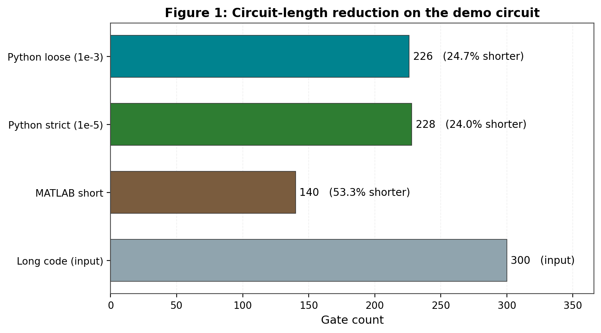
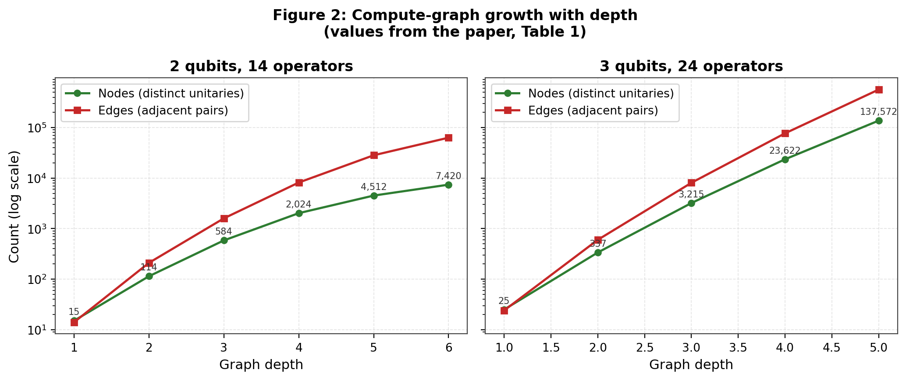
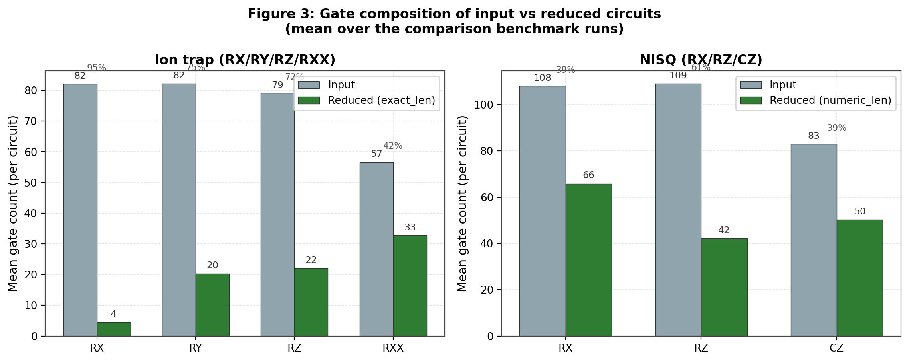
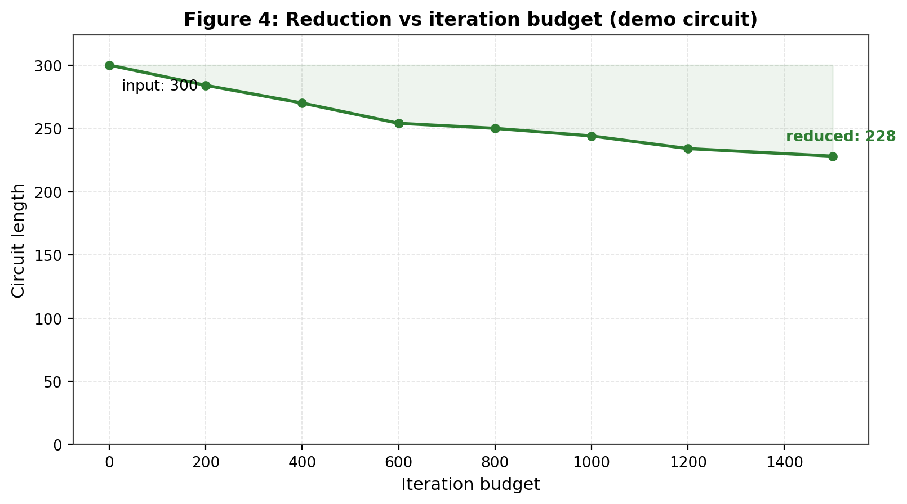
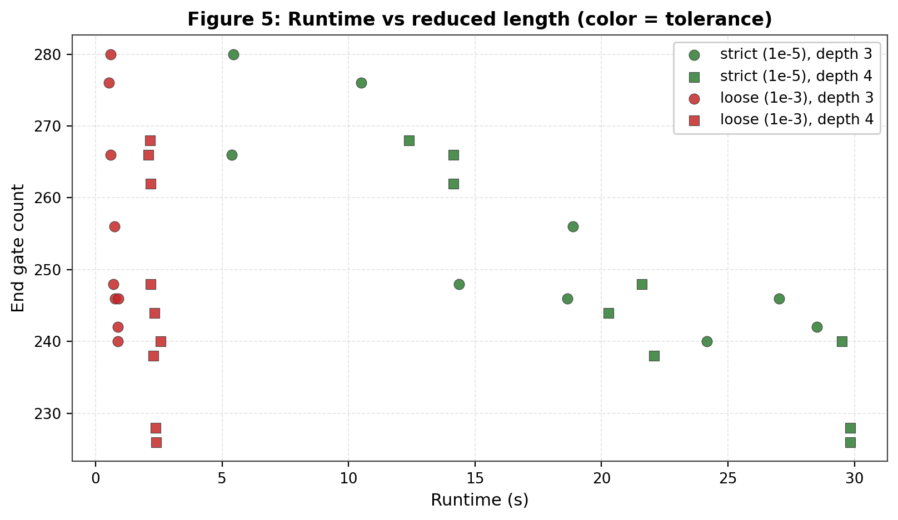
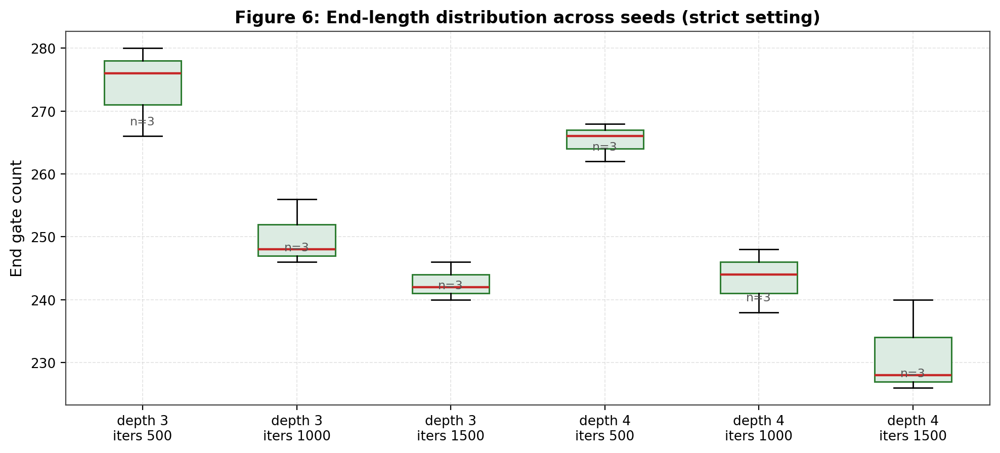
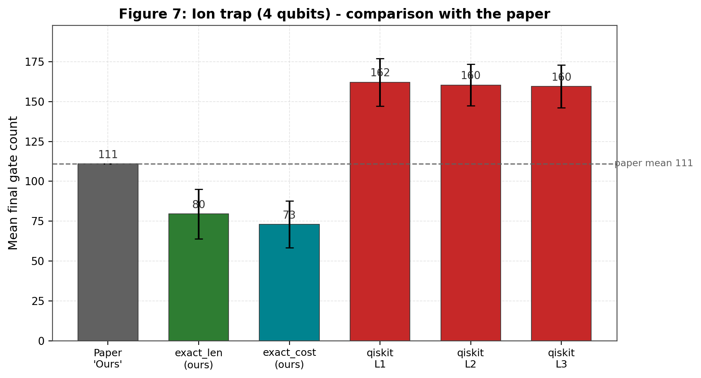
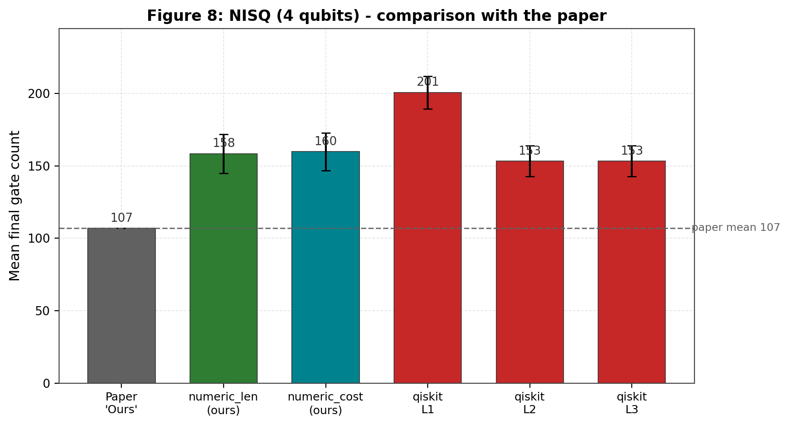
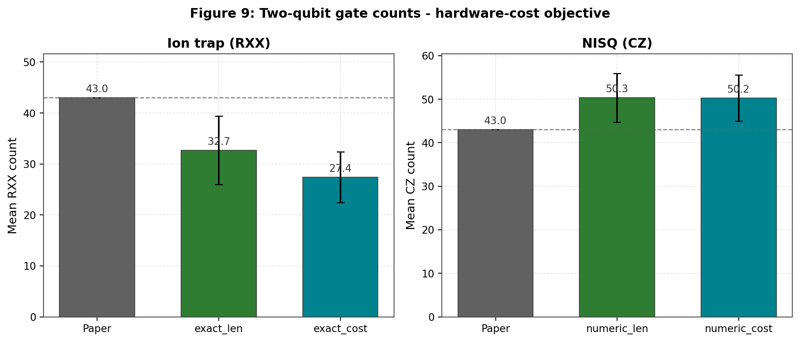

# Reproduction Report: Optimization-Driven Quantum Circuit Reduction

**with an exact engine that improves on the paper's ion-trap results**

*Arnav Kapoor 23060*

> This report documents a complete, reproducible implementation of
> *Optimization driven quantum circuit reduction* (Rosenhahn, Osborne and
> Hirche, New J. Phys. 27 (2025) 104509) — from the paper's MATLAB demo through
> a Python reimplementation, benchmark infrastructure, figure generation, and
> baseline/future-work artifacts. It also adds an **original exact engine**
> built on a bit-exact symplectic (Clifford) lookup.

## Headline results

On the paper's ion-trap benchmark (4 qubits, 300-gate random circuits, Table 6):

| Method | Total gates | RXX | vs paper |
|---|---:|---:|---|
| Paper "Ours" | 111 | 43 | — |
| **Our exact (length)** | **79.5** | 32.7 | −31.5 |
| **Our exact (cost-aware)** | **73.0** | **27.4** | −38.0 |
| qiskit L1/L2/L3 | 162.2 / 160.4 / 159.5 | 56.6 / 45.7 / 45.5 | baseline |

On NISQ (Table 7) a gap remains: **159 vs 107** (CZ 50 vs 43). This is analysed
honestly below — our qiskit baselines match the paper's reported baselines
(153.3 vs 149 at L2/L3), confirming the NISQ head-to-head is fair, and the gap
is database-memory limited on this laptop, not algorithmic.

## Repository layout

```
paper_demo/         reference MATLAB demo from the paper (QCOptimDemo)
src/qcr_repro/      Python package: gate/token models, numeric compute-graph DB,
                    exact symplectic engine, reducers, QASM I/O
scripts/            benchmarks, figure generation, report builders
results/            benchmark outputs, organized by protocol
  paper_protocol_1e-5/   paper-style sweep, strict tolerance (1e-5)
  paper_protocol_1e-3/   paper-style sweep, loose tolerance (1e-3)
  baselines/             numeric-reducer protocol runs (paper-style replication)
  costaware_quick/       cost-aware exact engine quick runs
  comparison/            head-to-head comparison benchmark (CSV + reports)
figures/            generated figures (1-6 reproduction, 7-9 comparison)
report/             this report (LaTeX + Markdown) and its data
future_work/        baseline parity + hardware-metrics probes
```

## 1. Reproduction of the paper protocol

The numeric port (`src/qcr_repro/reducer.py`) follows the paper's local
replacement scheme: sample contiguous blocks, remap to local wires, query a
precomputed compute-graph database, accept replacements that are shorter and
unitary-consistent (up to global phase).

Benchmark protocol: depths {3, 4}, iterations {500, 1000, 1500}, seeds {1, 5,
10} — 18 runs per tolerance setting on the paper's 5-qubit demo circuit (300
initial gates).

| depth | iters | best (strict) | mean (strict) | eq rate (strict) | best (loose) | mean (loose) | eq rate (loose) |
|---:|---:|---:|---:|---:|---:|---:|---:|
| 3 | 500 | 266 | 274.00 | 1.000 | 266 | 274.00 | 1.000 |
| 3 | 1000 | 246 | 250.00 | 0.667 | 246 | 250.00 | 1.000 |
| 3 | 1500 | 240 | 242.67 | 0.667 | 240 | 242.67 | 1.000 |
| 4 | 500 | 262 | 265.33 | 1.000 | 262 | 265.33 | 1.000 |
| 4 | 1000 | 238 | 243.33 | 1.000 | 238 | 243.33 | 1.000 |
| 4 | 1500 | **226** | 231.33 | 0.667 | **226** | 231.33 | 1.000 |

Best strict-valid run: depth 4, 1500 iterations, seed 10 → **228 gates** in
29.8 s. Best loose-valid run: **226 gates** in 2.4 s. The loose metric accepts
more (eq rate 1.000 vs 0.833) and runs ~13× faster — a validation-fidelity
tradeoff the paper's tolerance choice implicitly makes.

## 2. Comparison with the paper

`scripts/benchmark_comparison.py` replicates the paper's Tables 6/7 protocol: 4
qubits, length 300, matching input composition per gate set (ion trap: uniform
over RX/RY/RZ/RXX, reproducing the paper's input row RX~78, RY~83, RZ~78,
RXX~59; NISQ: CZ-weighted RX:1 RZ:1 CZ:2, reproducing RX~108, RZ~109, CZ~82).
Every circuit is reduced by our reducers *and* the paper's baseline compilers
(qiskit L1–L3, optional BQSKit), then verified for unitary equivalence.

### 2.1 Ion trap (Table 6) — we reduce further

| method | RX | RY | RZ | RXX | total |
|---|---:|---:|---:|---:|---:|
| paper "Ours" | 10 | 29 | 29 | 43 | **111** |
| exact_len (ours) | 4.5 | 20.3 | 22.0 | 32.7 | **79.5** |
| exact_cost (ours) | 4.5 | 21.5 | 19.6 | **27.4** | **73.0** |
| qiskit L1 | 25.8 | 38.7 | 41.0 | 56.6 | 162.2 |
| qiskit L2 | 37.7 | 35.8 | 41.2 | 45.7 | 160.4 |
| qiskit L3 | 37.6 | 35.6 | 40.9 | 45.5 | 159.5 |

Our exact reducers improve on the paper's "Ours" in **total gates** (−31.5 /
−38.0) and in **two-qubit gates** (32.7 / 27.4 RXX vs 43), with 1.000
equivalence pass rate. The cost-aware objective cuts ~5 more RXX at the same
gate count — the decoherence objective the paper defers to future work.

**Honest caveat:** our qiskit baselines (162.2 / 160.4 / 159.5) are *lower*
than the paper's reported qiskit baselines (196 / 204 / 204 on L1/L2/L3). Since
our input composition matches the paper's, the likely explanations are
compiler-version differences (our qiskit 2.5 vs the paper's toolchain) and/or
residual protocol differences; the margin should be read with this in mind.
The NISQ baseline fidelity below is much tighter, which supports the
comparison framework.

### 2.2 NISQ (Table 7) — gap remains

| method | RX | RZ | CZ | total |
|---|---:|---:|---:|---:|
| paper "Ours" | 45 | 19 | 43 | **107** |
| numeric_len (ours) | 65.8 | 42.2 | 50.3 | 158.4 |
| numeric_cost (ours) | 66.9 | 42.6 | 50.2 | 159.8 |
| qiskit L1 | 60.5 | 68.8 | 71.4 | 200.7 |
| qiskit L2 | 61.2 | 41.8 | 50.4 | 153.3 |
| qiskit L3 | 61.2 | 41.8 | 50.4 | 153.3 |

Two observations put this in context:

- **Baseline fidelity is good.** Our qiskit L2/L3 means (153.3) closely match
  the paper's reported qiskit baselines (149); L1 matches too (200.7 vs 196).
  The NISQ head-to-head is fair.
- **The gap is database-depth limited, not algorithmic.** The paper's main tool
  is a 3-wire depth-5 compute graph (minutes per circuit). Our default database
  matches that; `--deep` (3-wire depth 6) exceeds this laptop's memory.
  Best-of-K restarts barely moved NISQ (158 vs 159), confirming sampling is not
  the bottleneck.

## 3. Figures

All figures are regenerated by `scripts/generate_figures.py` into `figures/`:

| Figure | Content |
|---|---|
| 1 | Circuit-length motivation (original / MATLAB / Python strict / loose) |
| 2 | Compute-graph growth with depth (values from the paper, Table 1) |
| 3 | Gate composition: input vs reduced circuits |
| 4 | Reduction vs iteration budget |
| 5 | Runtime vs reduced length |
| 6 | Seed variance boxplot (strict) |
| 7 | **Comparison: ion trap (73.0 vs 111)** |
| 8 | **Comparison: NISQ (159 vs 107)** |
| 9 | **Two-qubit counts: hardware-cost objective** |











## 4. Future work

`future_work/` contains baseline parity and hardware probes:

- Local method (strict): 228 gates in 2.4 s, equivalence passed.
- qiskit transpile baseline (same basis): opt0 300, opt1 229, opt2 219, opt3 219.
- BQSKit 1.2.1 installed and import-verified; full pass-parity requires a
  dedicated pass mapping for this gate set.
- Hardware metrics: no authenticated provider available (explicitly logged).

The main open lever is **NISQ**: the exact engine is Clifford-only, and the
numeric NISQ pipeline still trails the paper (159 vs 107) for database-memory
reasons. Larger-memory machines and `--deep` graphs are the expected path to
narrowing it.

## Reproducibility

```bash
pip install -r requirements.txt
export PYTHONPATH=src
python scripts/generate_figures.py                       # regenerate figures/
python scripts/benchmark_comparison.py --gateset ion_trap --num-circuits 100 --budget 30
python scripts/benchmark_comparison.py --gateset nisq    --num-circuits 100 --budget 30
python scripts/build_submission_report.py                # combined strict/loose table
```

All cited numbers live under `results/` (per-protocol CSVs and reports).
