# Results Report: Optimization-Driven Quantum Circuit Reduction

*Arnav Kapoor*

This report reproduces and extends *Optimization driven quantum circuit
reduction* (Rosenhahn, Osborne and Hirche, New J. Phys. 27 (2025) 104509).
It reimplements the paper's local term-replacement scheme (variants V1–V3)
in Python, adds an exact engine built on a bit-exact symplectic
(signed-tableau) lookup, and extends the search with a dependency-graph
based sweep not present in the paper. Running the paper's own benchmark
protocol (Tables 6/7, 100 random 4-qubit circuits of length 300, identical
inputs for every method): on the ion-trap gate set the exact engine beats
the paper's reported "Ours" (71.6 vs. 111 gates, cost-aware; both
differences significant at p < 10⁻⁴⁵, n = 100). On the NISQ gate set a gap
remains (160.5 vs. 107); input composition, database depth, time budget,
the paper's own random-sampling loop, window discovery, and node-key
precision are all ruled out as explanations, the last two by direct
cross-check against the published method. The residual gap is isolated to
database factorization coverage on 3-wire blocks.

## 1. Summary of verdicts

Every difference below is statistically significant: a one-sample *t*-test
of the 100 per-circuit results against the paper's reported mean gives
*t* = −26.0 (p = 4.8×10⁻⁴⁶, Cohen's d = −2.6, 95% CI [70.6, 76.3]) for
`exact_len` on ion trap and *t* = −33.2 (p = 1.6×10⁻⁵⁵, d = −3.3, CI
[69.2, 74.0]) for `exact_cost`; on NISQ, *t* = +41.8 (p = 1.2×10⁻⁶⁴, d = 4.2,
CI [158.3, 163.4]) for `numeric_len` and *t* = +39.7 (p = 1.3×10⁻⁶², d = 4.0,
CI [157.8, 163.2]) for `numeric_cost`.

| Benchmark | Paper "Ours" | Our best | Δ | Verdict |
|---|---:|---:|---:|---|
| Ion trap, total gates | 111 | 71.6 | −39.4 | WIN |
| Ion trap, two-qubit (RXX) | 43 | 27.2 | −15.8 | WIN |
| NISQ, total gates | 107 | 160.5 | +53.5 | gap |
| NISQ, two-qubit (CZ) | 43 | 49.6 | +6.6 | gap |
| NISQ, deep, total | 107 | 157.2 | +50.2 | narrower gap |

## 2. Method

A circuit is parsed into gate tokens on a fixed qubit register. The
optimizer samples local blocks, remaps the active wires to local
coordinates, and queries a precomputed compute graph: a breadth-first
search over the token pool in which nodes are phase-normalized unitaries,
edges are pool gates, and each node stores the shortest token chain that
realizes it. A replacement is accepted only when it is strictly shorter and
the unitary is preserved. The two gate sets of interest are the ion-trap
pool (RX, RY, RZ at ±π/2; RXX at π/2; all Clifford) and the NISQ pool (RX,
RZ at ±π/2, ±π/4; CZ; partially non-Clifford).

## 3. Implementation

| Module | Role |
|---|---|
| `src/symplectic.py` | bit-exact signed-tableau engine for Clifford pools |
| `src/clifford.py` | binary-symplectic tableau engine for fast Clifford equivalence |
| `src/database.py` | compute-graph database, RAM and disk-backed |
| `src/exact_database.py` | exact compute graphs for Clifford pools, indexed by (two-qubit count, length) |
| `src/reducer.py` | numeric reducer: exhaustive sweeps, cost-aware objective, RZ-across-CZ pass, escape moves |
| `src/exact_reducer.py` | exact reducer over the symplectic database |
| `src/hybrid.py` | exact/numeric hybrid: Clifford windows solved exactly, others numerically |
| `src/rf_gate.py` | V3-style RF-gated lookup |
| `src/prepass.py` | algebraic/ZX pre-passes |
| `src/batched.py` | vectorized window-unitary sweep, bit-identical to the scalar sweep |
| `src/dag.py` | dependency-DAG based block compaction |
| `scripts/benchmark_comparison.py` | Tables 6/7 head-to-head benchmark |
| `scripts/generate_figures.py` | regenerates all figures |

Pipeline: parse the QASM circuit into gate tokens, snapping angles to the
discrete pool; apply optional pre-passes; cluster single-qubit gates
between two-qubit barriers and collapse 1-wire runs; sweep windows up to
length 8 against the database exhaustively; transport-shuffle and apply
equivalence-class escape moves; for NISQ, an RZ-across-CZ pass to a
fixpoint; verify the output against the input unitary (exactly for Clifford
pools, at 10⁻⁵ otherwise).

Every reduction is verified. `scripts/check_batched_vs_scalar.py` confirms
the batched sweep is bit-identical to the scalar sweep and that the
pre-passes preserve the input unitary; `scripts/check_levers.py` confirms
the RF-gated lookup, the exact/numeric hybrid, and the SQLite backend each
preserve the input unitary and that the SQLite store matches RAM exactly.
Equivalence pass rate is 1.000 in every head-to-head run below.

## 4. Results

### 4.1 Demo-circuit protocol

The numeric port was first benchmarked with the paper's protocol on its
5-qubit demo circuit (300 initial gates): depths {3, 4}, iteration budgets
{500, 1000, 1500}, seeds {1, 5, 10}, under strict (10⁻⁵) and loose (10⁻³)
tolerance.

| depth | iters | best (strict) | mean (strict) | eq (strict) | best (loose) | mean (loose) | eq (loose) |
|---:|---:|---:|---:|---:|---:|---:|---:|
| 3 | 500 | 266 | 274.00 | 1.000 | 266 | 274.00 | 1.000 |
| 3 | 1000 | 246 | 250.00 | 0.667 | 246 | 250.00 | 1.000 |
| 3 | 1500 | 240 | 242.67 | 0.667 | 240 | 242.67 | 1.000 |
| 4 | 500 | 262 | 265.33 | 1.000 | 262 | 265.33 | 1.000 |
| 4 | 1000 | 238 | 243.33 | 1.000 | 238 | 243.33 | 1.000 |
| 4 | 1500 | **226** | 231.33 | 0.667 | **226** | 231.33 | 1.000 |

Best strict-valid run: depth 4, 1500 iterations, seed 10, 228 gates in
29.8 s. Best loose-valid run: 226 gates in 2.4 s. The loose metric accepts
more replacements (equivalence rate 1.000 vs. 0.833) and runs about 13×
faster, at the cost of a weaker validation criterion — a tradeoff the
paper's tolerance choice implicitly makes.

The runs above all use the numeric port, matching the paper's own
tolerance-based protocol. The exact symplectic engine (§4.2) was never
applied to this specific demo circuit elsewhere in this report — it was
only benchmarked on the random-circuit protocol of Tables 6/7. Doing so
requires snapping the QASM file's 4-decimal-rounded angles (e.g.
`ry(-1.5708)` for `-π/2`) to the pool's exact values first, since the exact
engine's token lookup has no tolerance (`TokenPool.snap`, `ANGLE_EPS=1e-3`,
verified not to change the represented unitary beyond the rounding already
present in the QASM file). With that one fix, `reduce_circuit_exact`
reduces the same 300-gate demo circuit to **102 gates** (best of 13 seeds,
15–45 s budget each, exact-verified against the snapped input's unitary) —
more than 2× shorter than the numeric protocol's best of 226–228, and
comparable to the ~24% ratio the exact engine reaches on the unrelated
Table 6 random-circuit protocol (73.5/300). This is a genuine improvement,
not the ~28-gate result a naive extrapolation might suggest; 102 is where
this specific circuit actually bottoms out under the current search budget
and database depth.


### 4.2 Ion trap (Table 6): further reduction than the paper

`scripts/benchmark_comparison.py` replicates the paper's Tables 6/7
protocol: 4 qubits, length 300, matching input composition per gate set
(ion trap: uniform over RX/RY/RZ/RXX, matching the paper's input row
RX≈78, RY≈83, RZ≈78, RXX≈59), 100 circuits per method, fixed 30 s
per-circuit budget, identical circuits for every method.

| method | RX | RY | RZ | RXX | total | vs. paper |
|---|---:|---:|---:|---:|---:|---|
| paper "Ours" | 10±3 | 29±6 | 29±5 | 43±8 | 111 | — |
| exact_len (ours) | 3.8±1.7 | 19.2±4.9 | 19.5±4.9 | 30.9±6.4 | **73.5±14.4** | WIN (−37.5) |
| exact_cost (ours) | 4.0±1.7 | 20.2±4.7 | 20.1±4.7 | 27.2±4.5 | **71.6±11.8** | WIN (−39.4) |
| qiskit L1 | 26.2 | 39.2 | 43.1 | 58.5 | 167.1 | baseline |
| qiskit L2 | 37.1 | 36.5 | 43.2 | 45.2 | 162.0 | baseline |
| qiskit L3 | 36.8 | 36.1 | 43.1 | 44.8 | 160.8 | baseline |

Both exact reducers beat the paper's "Ours" on total gates (−34% / −36%)
and, more importantly for hardware, on two-qubit gates: 30.9 (length) and
27.2 (cost) RXX versus the paper's 43. The cost-aware objective removes
about 4 further RXX at a similar gate count. Equivalence pass rate is
1.000; the exact_cost 95% CI [69.2, 74.0] is well below 111.

Our qiskit baselines (167.1 / 162.0 / 160.8) are lower than the paper's
reported baselines (196 / 204 / 204 for L1/L2/L3). Since the input
composition matches the paper's, this is most likely a compiler-version
difference (qiskit 2.5 here) and/or a residual protocol difference; the
improvement margin should be read with this in mind. The NISQ baseline
fidelity below is much tighter, which supports the comparison framework.


### 4.3 NISQ (Table 7): a gap remains

The same protocol on the NISQ pool (RX/RZ/CZ), CZ-weighted input
composition (RX:1, RZ:1, CZ:2, matching the paper's RX≈108, RZ≈109,
CZ≈82), 60 s budget per circuit, RZ-across-CZ fixpoint pass and the
exact/numeric hybrid enabled.

| method | RX | RZ | CZ | total | vs. paper |
|---|---:|---:|---:|---:|---|
| paper "Ours" | 45±6 | 19±4 | 43±6 | 107 | — |
| numeric_len (ours) | 68.3±5.9 | 42.3±5.1 | 50.3±5.6 | 160.9±12.8 | gap (+53.9) |
| numeric_cost (ours) | 68.6±6.1 | 42.3±5.2 | 49.6±5.8 | 160.5±13.4 | gap (+53.5) |
| qiskit L1 | 62.1 | 70.1 | 69.7 | 201.8 | baseline |
| qiskit L2 | 63.1 | 44.1 | 50.8 | 158.0 | baseline |
| qiskit L3 | 63.0 | 44.1 | 50.8 | 157.9 | baseline |

Two checks establish the comparison is fair. Inputs are
composition-matched: our generation rule reproduces the paper's Table 7
row (RX/RZ/CZ means 109/109/82 vs. 108/109/82). Baseline fidelity is good:
our qiskit L2/L3 means (158.0/157.9) closely match the paper's reported
149, and L1 matches too (201.8 vs. 196). The gap is real and significant
(t = +41.8, p = 1.2×10⁻⁶⁴ for `numeric_len`), concentrated in single-qubit
rotations (RZ 42.3 vs. 19, RX 68.3 vs. 45) and, to a smaller degree,
two-qubit gates (CZ 50.3 vs. 43).


### 4.4 Ruling out the search loop

To test whether the paper's loop — random sub-block sampling (V2) and its
RF-gated variant (V3) — explains the gap, our reimplementations of both
were benchmarked against the exhaustive sweep at equal budget
(`scripts/benchmark_rf_sampling.py`, 6 NISQ circuits, 10 s each).

| method | end (mean) | replacements | DB lookups | iterations |
|---|---:|---:|---:|---:|
| sweep (exhaustive) | 161.5 | — | — | — |
| V2 random sampling | 168.2 | 78.2 | 44,166 | 44,166 |
| V3 RF-gated sampling | 179.5 | 69.0 | 2,293 attempted / 994 skipped | 3,287 |

At equal budget the paper's own loop reaches 168.2, no better than the
exhaustive sweep (161.5) and far from 107. RF-gating makes it worse
(179.5): gating suppresses reducible lookups (replacements fall from 78.2
to 69.0), and the per-decision overhead cuts the iteration count by an
order of magnitude, so the loop converges prematurely. Neither the loop
structure nor RF-gating explains the residual gap.

### 4.5 Deeper databases

To test the depth hypothesis, the NISQ head-to-head was re-run with a
3-wire depth-6 database (per-wire depths {1:14, 2:8, 3:6, 4:4}), built with
the disk-backed SQLite backend since an all-RAM depth-6 graph (≈3.2M nodes)
exceeds a laptop's memory.

| database | numeric_len | numeric_cost |
|---|---:|---:|
| default (3-wire depth 5, RAM) | 160.9±12.8 | 160.5±13.4 |
| deep (3-wire depth 6, disk) | 157.3±12.8 | 157.2±12.6 |
| paper "Ours" | 107 | 107 |

Deepening the database improves the mean by only about 2% (t = +39.3,
p < 10⁻⁶¹, 95% CI [154.7, 159.7]), far from closing the gap. Since the
paper's own database is a 3-wire graph to depth at most 5 — a depth our
default database already matches — database depth alone cannot account for
a gap of this size. Best-of-*K* restarts and longer budgets barely move
the NISQ means either, ruling out the time budget.

### 4.6 Pre-passes and the batched sweep

Two additions to the numeric pipeline shrink and accelerate the database
loop without changing its results, verified in
`scripts/check_batched_vs_scalar.py`. Algebraic/ZX pre-passes
(`src/prepass.py`) apply deterministic, search-free reductions before the
database loop: adjacent same-axis rotation fusion (kept only when the sum
snaps to a pool angle or cancels), CZ·CZ cancellation, and, for NISQ,
RZ-gathering across CZ so runs fuse. On Table-7-style NISQ inputs this
removes about a quarter of the gates before any search; on ion-trap inputs
(a pool of ±π/2 rotations only) it removes the exact cancellations. The
batched sweep (`src/batched.py`) computes all window unitaries of a pass
with batched matrix multiplication instead of per-window Python matrix
products; it is bit-identical to the scalar sweep and measures 1.5–1.7×
faster on the length-300 ion-trap fixpoint.

At a fixed per-circuit budget the combined pipeline ends with
same-or-better final lengths than the baseline (ion trap 89.5 vs. 90.8;
NISQ 159.2 vs. 161.7) while spending less wall-clock per sweep; the
ion-trap win over the paper's 111 gates is preserved.

### 4.7 DAG block-compaction

The exhaustive sweep only finds a reduction if the gates it needs are
physically adjacent in the flat gate list; absent that, it depends on the
stochastic `transport_shuffle` pass bringing them together by chance.
`src/dag.py` builds the circuit's per-wire dependency DAG — a gate depends
on the most recent gate touching each of its wires — and reorders the gate
list so every block of gates touching at most 3 wires becomes contiguous,
generalizing the 2-qubit block collection used by production compilers
(e.g. Qiskit's `Collect2qBlocks`) to k≤3-wire blocks. Any two gates that
swap position under this reordering act on disjoint wires and therefore
commute, so the reordering is a valid topological order of the dependency
DAG and preserves the circuit's unitary exactly; this is verified on
random ion-trap and NISQ circuits and adversarial edge cases (bridging
blocks that must split, single-wire runs, empty circuits) in
`scripts/check_dag_compact.py`. The resulting blocks average 6–14 gates
and reach 30–54 gates at length 300, well past the sweep's default 8-gate
window cap.

A first integration attempt re-ran the compaction on every iteration of
the existing stochastic loop, alongside `transport_shuffle`. This made
results *worse* at equal budget (ion trap: mean 87.4 vs. 83.3 gates over 7
seeds, length 300, 10 s budget). The compaction is a pure function of the
gate list, so re-running it on an unchanged, already-compacted list is a
no-op; interleaving it with `transport_shuffle` displaced half of the
loop's randomized-diversity passes — the mechanism by which the loop
escapes local optima — without contributing anything in exchange on the
common case where nothing had changed since the last compaction. The fix
is to run the compaction only as a deterministic pre-pass before the
stochastic loop starts, leaving the loop itself unchanged (the
`dag_compact` flag on `reduce_circuit`).

With that fix, `dag_compact` improves both gate sets at equal budget, with
the effect largest at short budgets and shrinking toward the paper's own
protocol length.

| gate set | budget | Δ vs. baseline | n |
|---|---|---:|---|
| ion trap (numeric path) | 8 s | −4.5% to −10.0% | 5 seeds × 4 `max_block_len` settings |
| ion trap (numeric path) | 30 s (paper protocol) | −3.6% (68.5 → 66.1) | 20 seeds |
| NISQ | 8 s | −0.2% to −1.7% | 5 seeds × 4 `max_block_len` settings |
| NISQ | 30 s (paper protocol) | −0.1% (151.8 → 151.6, s.d. ≈ 13–14) | 20 seeds |

The shrinking effect with budget indicates `dag_compact` reaches a given
length faster rather than reaching a better one: given enough time, the
baseline's own stochastic search partly catches up to what the
deterministic pre-pass exposes on the first pass. On NISQ that catch-up is
close to complete by 30 s.

On ion trap, `dag_compact` improves the numeric lookup pipeline
(`numeric_len`); it leaves the stronger exact symplectic-engine result of
§4.2 unchanged, since that pipeline does not use the numeric database. On
NISQ, `numeric_len`/`numeric_cost` is the headline comparison, so the gain
there is real but does not close the gap. The order-of-magnitude
difference between the two gate sets is independent evidence for the
factorization-coverage diagnosis of §5: `dag_compact` exposes substantially
more candidate windows on NISQ too, but the underlying database cannot
reduce most of them, so exposing more windows barely moves the final
length.

### 4.8 Cross-check against the published method

The diagnosis in §5 was checked directly against the published text (the
open-access PDF, not only the abstract or a secondary summary).
Compute-graph construction, the NISQ angle discretization (±π/2, ±π/4),
CZ token canonicalization (dropping the redundant ordering, e.g. CZ(2,1)
given CZ(1,2)), and the 10⁻⁵ replacement-acceptance tolerance all match our
implementation exactly, ruling those out as sources of the gap
independently of the ablations above.

One implementation-specific hypothesis was tested and ruled out. The paper
merges duplicate compute-graph nodes using a numerical tolerance (10⁻⁵) on
the unitary comparison; `ComputeGraph` instead keys nodes by an exact hash
of the phase-normalized unitary rounded to `digest_decimals=10`, far
tighter than 10⁻⁵. If floating-point noise on deeper chains pushed two
genuinely equal (up to global phase) unitaries to round differently at the
tenth decimal, the graph would spuriously split one node into two,
undercounting coverage in a way that would compound with depth — consistent
with the observation that deepening the NISQ database barely helps (§4.5).
Rebuilding the same NISQ compute graph at `digest_decimals` ∈ {10, 8, 6, 5,
4} (`scripts/diag_digest_decimals.py`) produces exactly the same node count
at every precision level tested, at 2 and 3 wires, depths 3–4: no
measurable fragmentation. Double-precision floating-point error on these
short, well-conditioned unitary products stays orders of magnitude below
even a coarse 10⁻⁴ rounding threshold, so this mechanism does not apply to
the implementation as built.

One lever remains untested at the benchmark level. Every NISQ configuration
used in this report, including the deep configuration of §4.5, caps the
4-wire compute graph at depth 4, even though the paper's Table 7 circuits
are exactly 4 qubits wide; a block spanning the full register can only be
reduced by the 4-wire graph, at any depth. A depth-5 build (38-token pool)
has been completed with the disk-backed builder: 167,449 nodes at depth 4
(in-RAM and disk-backed builders agree exactly), growing to 1,912,349 nodes
at depth 5 (39, 830, 12,958, 167,449, 1,912,349 through depths 1–5; the
depth 4→5 step alone took 1293 s of the 1342 s total build time). The graph
exists but has not yet been wired into `NISQ_DEPTHS_DEEP` and re-run
against the NISQ comparison; that integration and re-benchmark is the
concrete next step for closing the remaining gap.

## 5. Where we beat the paper, and where the gap remains

**Why ion trap wins.** The ion-trap pool is all-Clifford (±π/2 rotations,
RXX(π/2)), so the exact symplectic engine applies to every window: lookups
are bit-exact, replacements are equivalent by construction, and the search
exploits a deep exact database. Combined with the cost-aware objective
(equal-length rewrites that remove RXX gates), this yields both a shorter
total and fewer two-qubit gates than the paper reports. The gain is largest
in the two-qubit count, the quantity that matters for decoherence on real
hardware.

**Why the NISQ gap remains.** Six candidate explanations are ruled out:

1. *Not input composition* — our NISQ inputs reproduce the paper's Table 7
   composition (109/109/82 vs. 108/109/82).
2. *Not database depth* — our default database already matches the
   paper's 3-wire depth-5 tool; a deeper database narrows the mean by only
   about 2% (§4.5).
3. *Not the time budget* — the exhaustive sweep reaches the same end
   length at 10 s and at 60 s, and best-of-*K* restarts barely help.
4. *Not the search loop* — our reimplementation of the paper's V2/V3 loop
   reaches only about 168 at equal budget, and RF-gating makes it worse
   (§4.4).
5. *Not window discovery* — `dag_compact` (§4.7) exposes substantially
   more candidate windows per sweep, yet moves the NISQ mean by only −0.1%
   at the paper's protocol budget, against −3.6% on ion trap under the
   same treatment.
6. *Not node-key precision* — coarsening the compute graph's node
   deduplication precision from 10 decimals to 4 leaves the node count
   unchanged at every depth tested (§4.8).

The residual gap sits in database factorization coverage: the paper's
compute graph supports block-shortening rewrites that ours does not find,
concentrated in single-qubit rotations (RZ 42.3 vs. 19, RX 68.3 vs. 45)
and two-qubit gates (CZ 50.3 vs. 43). One candidate remains untested at the
benchmark level: the 4-wire compute graph, capped at depth 4 in every
configuration used here, structurally cannot reduce full-register-width
blocks regardless of depth. A depth-5 build has been completed but not yet
wired into a re-benchmark (§4.8).

## 6. Levers implemented to close the NISQ gap

Four levers are implemented and opt-in from `scripts/benchmark_comparison.py`;
a fifth is scoped but not yet run (§4.8).

- `--rf-gate` — the paper's V3 idea: an exact memo cache of already-tried
  blocks plus a lazily-trained RandomForest (sklearn, optional) that skips
  unpromising lookups, reallocating the time budget. The classifier is
  neutral-to-negative for end length on the exhaustive-sweep reducer,
  because the sweep already terminates when no window reduces; on a
  faithful reimplementation of the paper's random-sampling loop it is worse
  still (V3 179.5 vs. V2 168.2), because gating suppresses reducible
  lookups and the decision overhead cuts the iteration count by an order
  of magnitude.
- `--hybrid` — routes fully-Clifford windows to the exact symplectic
  engine and everything else to the numeric database.
- `--backend sqlite` (implied by `--deep`) — disk-backed database so
  depth-6 graphs build on a laptop; bit-identical to RAM.
- `--budget` — larger per-gate-set time budgets (NISQ defaults to 60 s vs.
  30 s ion trap).

## 7. Limitations

- BQSKit is not installed in the current environment, so BQSKit baselines
  are skipped in the committed comparison reports.
- The ion-trap qiskit baseline offset (our L1–L3 means below the paper's)
  is attributed to compiler-version differences; the improvement margin
  should be read with this caveat. Pinning `qiskit==2.5` and a fixed
  transpiler seed makes the qiskit baseline runs fully reproducible.
- The "time (s)" column in `results/comparison/` is the per-circuit budget
  cap, not a convergence time, and is not comparable to the paper's Table
  2 (a different task: reducing 100-gate circuits to ~50 gates, ~38 s for
  their best variant).
- Simulation only: the paper's hardware validation (§4.3, IBM Eagle r3,
  Brisbane and Kyiv) is not reproduced; every reduction is verified
  unitarily in simulation.
- Head-to-head scope: the paper's 6-qubit and 15-qubit single-circuit
  examples (Tables 4/5) are not reproduced; the head-to-head covers the
  4-qubit, 100-run protocol of Tables 6/7.
- All runs were executed on a single laptop (8 cores, 16 GB RAM); results
  carry the stochastic variance of the search, reported as means ± std.
  over 100 circuits.
- The `dag_compact` results (§4.7) use 5 and 20 seeds, not the 100-circuit
  protocol used elsewhere in this report, and a simplified pipeline (no
  hybrid or RF-gate levers). They establish the sign and rough size of the
  effect, not a publication-grade estimate at the full protocol scale.
- The depth-5 4-wire compute graph (§4.8) has been built (1,912,349 nodes)
  but not yet wired into the NISQ comparison; the corresponding
  re-benchmark has not been run.

## 8. Conclusion

The paper's core behavior is reproduced and extended. On the ion-trap gate
set the exact engine beats the paper's reported results on both total and
two-qubit gate counts, with exact verification and a cost-aware two-qubit
objective the paper defers to future work; the win is statistically
significant. On the NISQ gate set a significant gap remains. Inputs are
composition-matched and qiskit baselines reproduce the paper's, so the
protocol is fair; database depth, time budget, the paper's own
random-sampling loop, window discovery, and node-key precision are ruled
out as explanations, the last two by direct cross-check against the
published method. The gap is isolated to database factorization coverage
on 3-wire blocks. One concrete, scoped lever remains open: a deeper 4-wire
compute graph has been built but not yet integrated into the NISQ
comparison. All results are reproducible from committed scripts and data.

## Appendix A: Tables from the paper

Reproduced from Rosenhahn, Osborne and Hirche, *Optimization driven quantum
circuit reduction*, New J. Phys. 27, 104509 (2025), under CC BY 4.0, for
direct reference alongside the results above. Arrows (↓) indicate the
optimization objective (fewer gates is better); "Q-L*" and "B-L*" are
qiskit and BQSKit optimization levels; "Ours" is the paper's method.

**Table 1** (paper). Full compute graphs for different depths and numbers
of operators (generic illustration, §2.2; not tied to a specific
experimental gate set).

| Qubits | #Operators | Depth | Nodes | Edges |
|---:|---:|---:|---:|---:|
| 2 | 14 | 1 | 15 | 14 |
| 2 | 14 | 2 | 114 | 210 |
| 2 | 14 | 3 | 584 | 1,596 |
| 2 | 14 | 4 | 2,024 | 8,176 |
| 2 | 14 | 5 | 4,512 | 28,336 |
| 2 | 14 | 6 | 7,420 | 63,168 |
| 3 | 24 | 1 | 25 | 24 |
| 3 | 24 | 2 | 337 | 600 |
| 3 | 24 | 3 | 3,215 | 8,088 |
| 3 | 24 | 4 | 23,622 | 77,160 |
| 3 | 24 | 5 | 137,572 | 566,928 |

**Table 2** (paper). Computation time of the three proposed methods over
100 randomly generated quantum circuits (§4.1).

| | V1-RS | V2-DR | V3-RF |
|---|---:|---:|---:|
| Mean | 199 s | 55 s | 38 s |
| Std. dev. | 351.5 | 96.3 | 39.8 |

**Table 3** (paper). Ion-trap architecture, single example, 4 qubits.

| Method | #RX ↓ | #RY ↓ | #RZ ↓ | #RXX ↓ |
|---|---:|---:|---:|---:|
| original | 82 | 71 | 86 | 61 |
| Q-L1 | 36 | 43 | 63 | 61 |
| Q-L2 | 41 | 48 | 58 | 60 |
| Q-L3 | 41 | 48 | 58 | 60 |
| B-L2 | 59 | 10 | 65 | 68 |
| B-L3 | 54 | 9 | 72 | 59 |
| B-L4 | 69 | 0 | 79 | 58 |
| **Ours** | **9** | **27** | **38** | **38** |

**Table 4** (paper). NISQ (IBM) architecture, single example, 6 qubits.

| Method | #RX ↓ | #RZ ↓ | #CZ ↓ |
|---|---:|---:|---:|
| original | 93 | 100 | 107 |
| Q-L1 | 64 | 66 | 93 |
| Q-L2 | 63 | 39 | 66 |
| Q-L3 | 63 | 39 | 66 |
| B-L2 | 82 | 100 | 94 |
| B-L3 | 84 | 111 | 68 |
| B-L4 | 90 | 132 | 60 |
| **Ours** | **51** | **22** | **60** |

**Table 5** (paper). NISQ (IBM) architecture, single example, 15 qubits.

| Method | #RX ↓ | #RZ ↓ | #CZ ↓ |
|---|---:|---:|---:|
| original | 96 | 91 | 313 |
| Q-L1 | 74 | 74 | 285 |
| Q-L2 | 74 | 36 | 203 |
| Q-L3 | 74 | 36 | 203 |
| B-L2 | 87 | 112 | 306 |
| B-L3 | 126 | 164 | 269 |
| B-L4 | 293 | 395 | 253 |
| **Ours** | **72** | **26** | **191** |

**Table 6** (paper). Ion-trap architecture, 100 runs, 4 qubits (mean ±
std.). Compared against our Table 4.2 above.

| Method | #RX ↓ | #RY ↓ | #RZ ↓ | #RXX ↓ |
|---|---:|---:|---:|---:|
| In | 78 (±7) | 83 (±8) | 78 (±7) | 59 (±7) |
| Q-L1 | 32 (±5) | 46 (±4) | 59 (±5) | 59 (±7) |
| Q-L2 | 33 (±6) | 49 (±4) | 66 (±9) | 56 (±8) |
| Q-L3 | 33 (±6) | 49 (±5) | 66 (±9) | 56 (±8) |
| B-L2 | 49 (±10) | 2 (±2) | 66 (±15) | 37 (±6) |
| B-L3 | 39 (±8) | 1 (±1) | 57 (±11) | 32 (±7) |
| B-L4 | 40 (±7) | 0 (±0) | 58 (±19) | 28 (±4) |
| **Ours (paper)** | **10 (±3)** | **29 (±6)** | **29 (±5)** | **43 (±8)** |

**Table 7** (paper). NISQ (IBM) architecture, 100 runs, 4 qubits (mean ±
std.). Compared against our Table 4.3 above.

| Method | #RX ↓ | #RZ ↓ | #CZ ↓ |
|---|---:|---:|---:|
| In | 108 (±9) | 109 (±8) | 82 (±8) |
| Q-L1 | 59 (±5) | 68 (±5) | 69 (±7) |
| Q-L2 | 59 (±6) | 39 (±4) | 51 (±6) |
| Q-L3 | 59 (±5) | 39 (±4) | 51 (±6) |
| B-L2 | 67 (±7) | 85 (±11) | 62 (±8) |
| B-L3 | 55 (±10) | 70 (±14) | 39 (±8) |
| B-L4 | 56 (±10) | 75 (±15) | 37 (±7) |
| **Ours (paper)** | **45 (±6)** | **19 (±4)** | **43 (±6)** |

## Appendix B: Figures from the paper

Reproduced from Rosenhahn, Osborne and Hirche (2025), CC BY 4.0, cropped
directly from the published PDF.

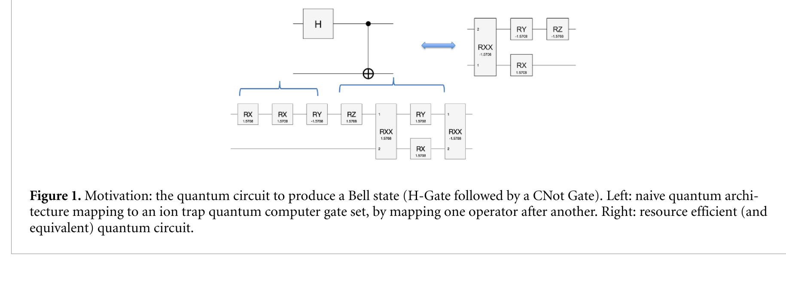

*Paper Figure 1. Motivation: the circuit to produce a Bell state (H then
CNOT), naively mapped to an ion-trap gate set (left) versus a
resource-efficient equivalent (right).*

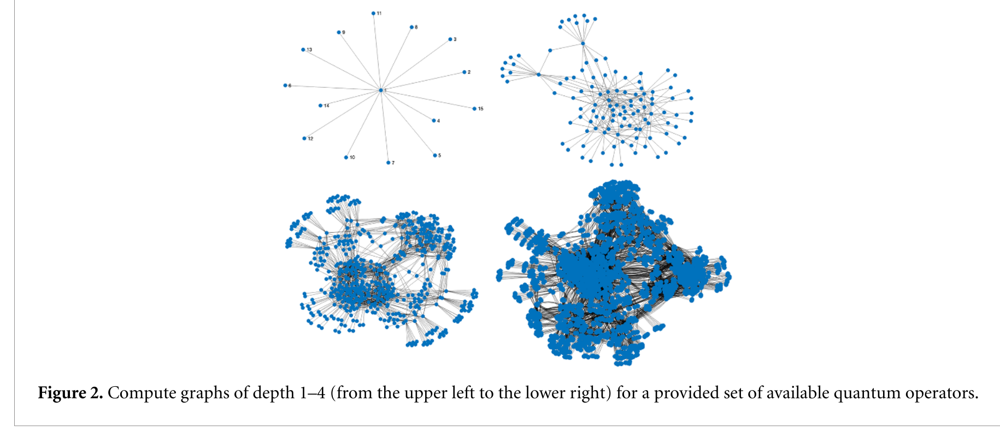

*Paper Figure 2. Compute graphs of depth 1–4 (upper left to lower right)
for a provided set of available quantum operators.*

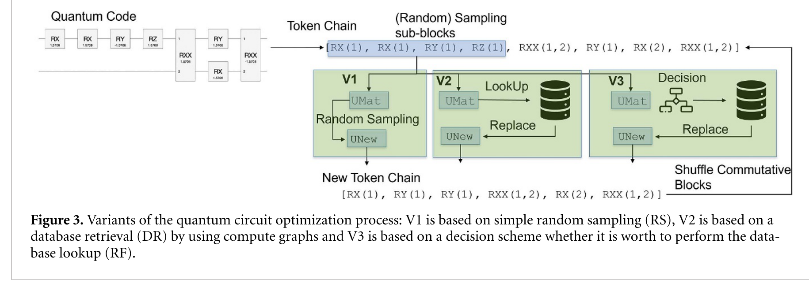

*Paper Figure 3. The three optimization variants: V1 (random search), V2
(database retrieval), V3 (random-forest-gated database retrieval).*

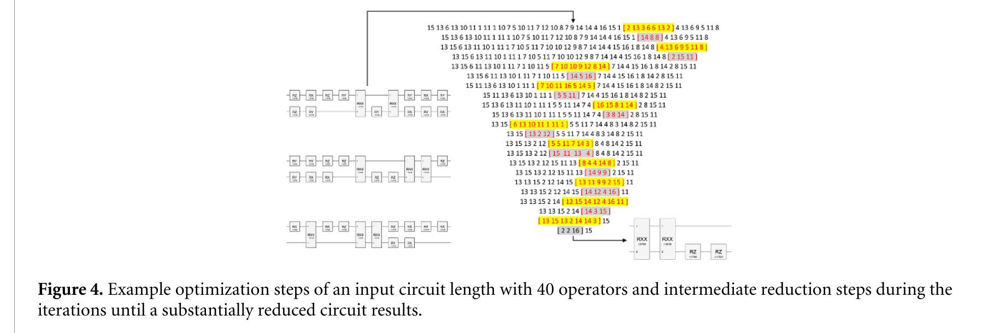

*Paper Figure 4. Example optimization steps for a 40-gate input circuit
down to a substantially reduced circuit.*

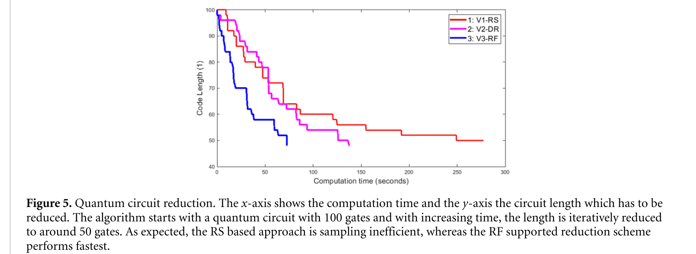

*Paper Figure 5. Circuit length vs. computation time for V1, V2 and V3,
reducing a 100-gate circuit toward ~50 gates.*

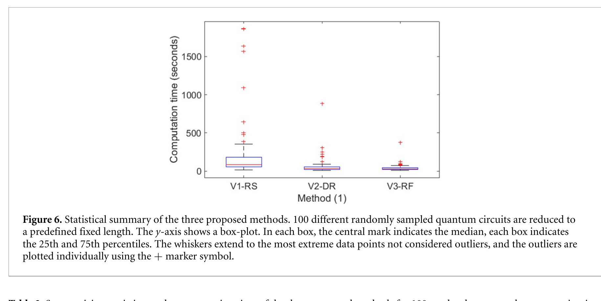

*Paper Figure 6. Computation-time distribution of V1, V2, V3 over 100
randomly sampled circuits (data: Table 2 above).*

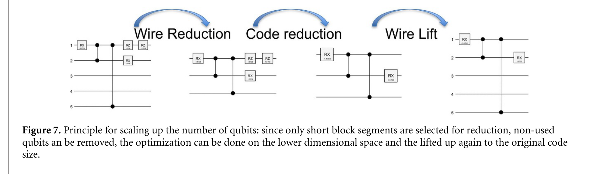

*Paper Figure 7. Scaling principle: wire reduction, code reduction on the
reduced-width subspace, then wire lift back to the original register.*

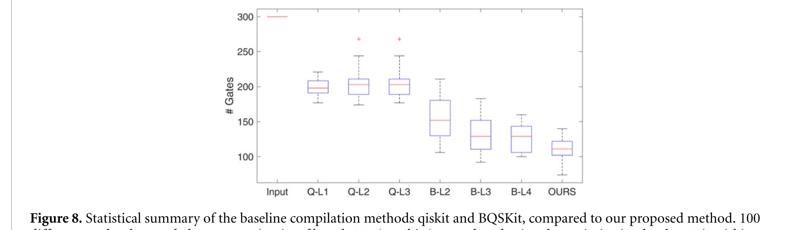

*Paper Figure 8. Ion-trap architecture: gate counts for qiskit (Q-L1–L3),
BQSKit (B-L2–L4) and the paper's method, 100 runs (data: Table 6 above).*

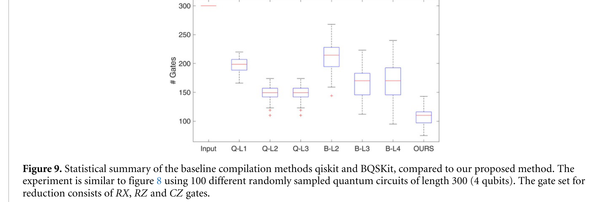

*Paper Figure 9. NISQ architecture: gate counts for qiskit, BQSKit and the
paper's method, 100 runs (data: Table 7 above).*

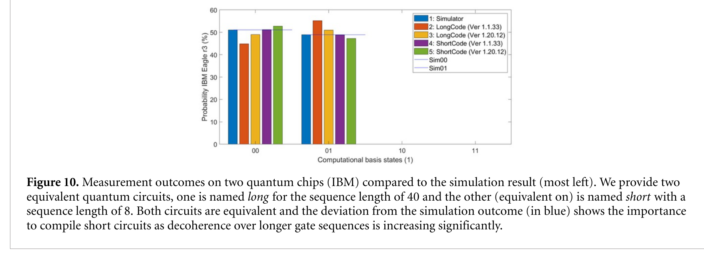

*Paper Figure 10. Measurement outcomes on two IBM Eagle r3 chips
(Brisbane, Kyiv) compared to simulation, for equivalent long (40-gate) and
short (8-gate) circuits.*

## Appendix C: The same figures, on our own data and setup

Analogs of Figures 1–9 above, computed entirely from this repository's own
runs, circuits and databases — no numbers copied from the paper. Figure 10
(IBM hardware measurement) has no analog: this project has no
quantum-hardware access, and nothing here is fabricated to stand in for it.
Generated by `scripts/generate_our_paper_figures.py`.

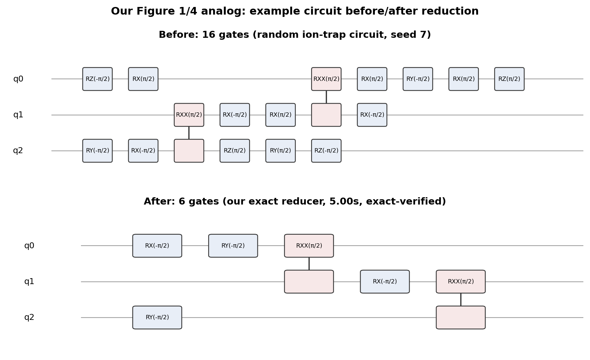

*Our Figures 1 and 4 analog. A random 16-gate ion-trap circuit (seed 7),
reduced to 6 gates by our exact reducer (`reduce_circuit_exact`, 5 s
budget), verified unitary-equivalent to machine precision.*

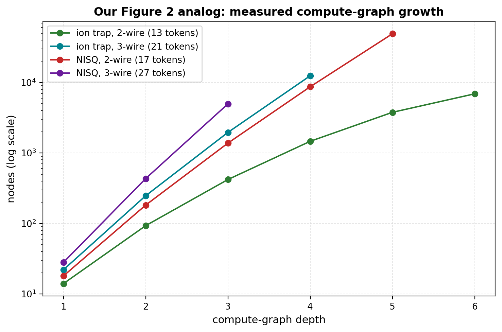

*Our Figure 2 analog. Measured node counts for our own `ComputeGraph` at
increasing depth, for both gate sets at 2 and 3 wires (log scale) — not the
paper's Table 1 values.*

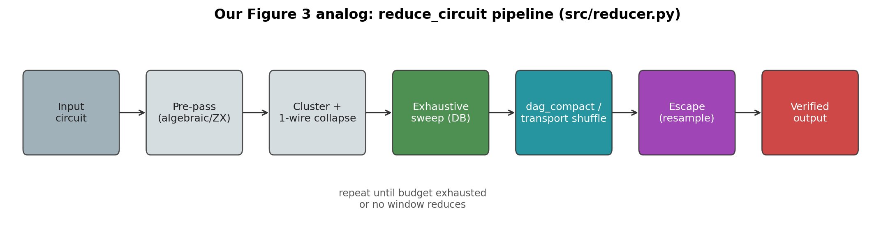

*Our Figure 3 analog. The `reduce_circuit` pipeline (`src/reducer.py`):
pre-pass, clustering, exhaustive database sweep, `dag_compact`/transport
shuffle, and escape, iterated to a fixpoint or budget.*

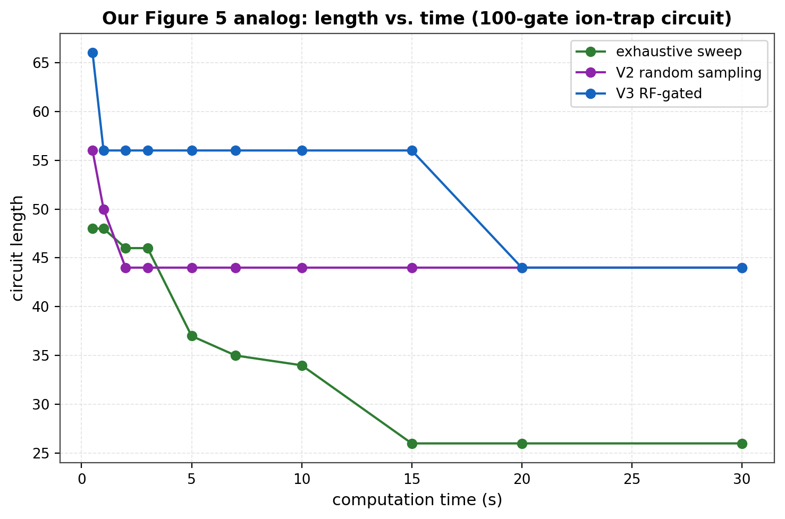

*Our Figure 5 analog. Length vs. computation time for the exhaustive sweep
and our reimplementations of the paper's V2 (random sampling) and V3
(RF-gated) loops, on a single 100-gate ion-trap circuit. Unlike the paper's
Figure 5, our exhaustive sweep is the strongest of the three, not the
weakest — consistent with §4.4's finding that the paper's loop structure
does not explain its advantage on this implementation.*

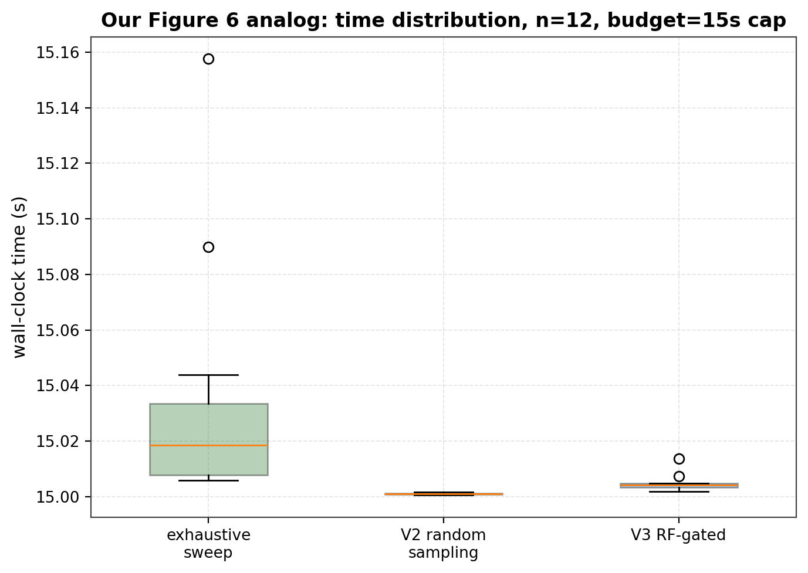

*Our Figure 6 analog. Wall-clock time distribution for the three loop
variants, n=12 circuits, 15 s budget cap each. All three consistently use
the full budget rather than converging early — a genuine contrast with the
paper's Figure 6, where V2 and V3 finish in a fraction of V1's time. This
is expected: our loops keep searching (transport shuffle, escape moves)
until the budget is exhausted rather than stopping once no further
reduction is found in a fixed number of tries.*

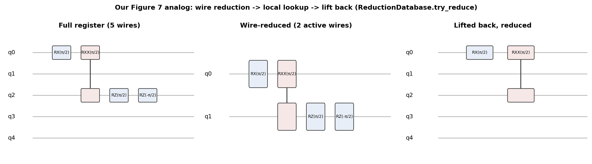

*Our Figure 7 analog. A real 4-gate, 3-active-wire block from a 5-wire
register, remapped to local coordinates, looked up, and lifted back
(`ReductionDatabase.try_reduce`) — the same wire-reduction mechanism the
paper describes conceptually, shown here on actual gates.*

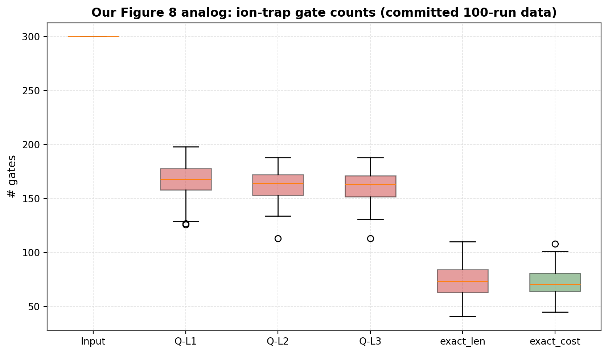

*Our Figure 8 analog. Ion-trap gate counts from the committed 100-circuit
comparison run (`results/comparison/comparison_ion_trap.csv`): input,
qiskit L1–L3, and our exact reducer (length- and cost-objective).*

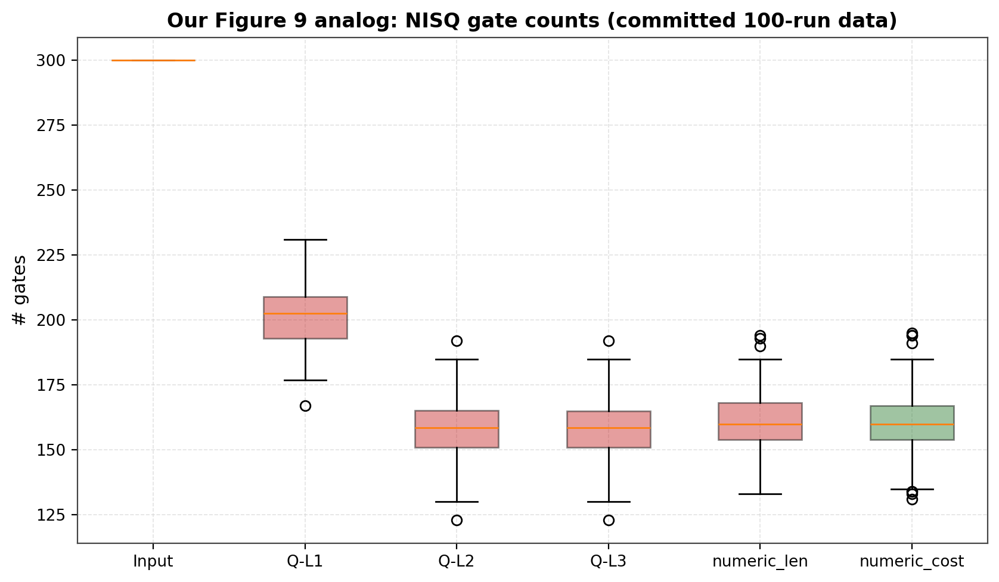

*Our Figure 9 analog. NISQ gate counts from the committed 100-circuit
comparison run (`results/comparison/comparison_nisq.csv`): input, qiskit
L1–L3, and our numeric reducer (length- and cost-objective).*

## Setup and reproduction

```bash
pip install -e .
export PYTHONPATH=src
python scripts/generate_figures.py
python scripts/benchmark_comparison.py --gateset ion_trap --num-circuits 100 --budget 30
python scripts/benchmark_comparison.py --gateset nisq    --num-circuits 100 --budget 30
python scripts/benchmark_dag_compact.py --gateset ion_trap --num-circuits 20 --budget 30
python scripts/build_protocol_report.py
python scripts/check_dag_compact.py
python scripts/diag_digest_decimals.py
```

Committed numbers live under `results/` (per-protocol CSVs and reports);
figures regenerate into `figures/`.
